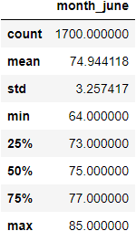
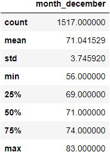

# Surfs Up - Temp Analysis - Oahu, HI

## Overview of the analysis
W. Avy likes the analysis so far, but he wants more information about temperature trends before opening the surf shop. Specifically, he wants temperature data for the months of June and December in Oahu, in order to determine if the surf and ice cream shop business is sustainable year-round.  Using June and December will provide a 6 month spread to target the warmest time of the year and what a "cold" month would look like for business.

## Results 

### June Weather Findings & Statistics
* June Average Temp Observed : 74.9 ℉
* June Max Temp Observed : 85 ℉	
* June Min Temp Observed : 64 ℉	

### December Weather Findings & Statistics
* December Average Temp Observed : 71 ℉
* Decebmer Max Temp Observed : 83 ℉	
* December Min Temp Observed : 56 ℉	

   
* Major Point 2

* Major Point 3

## Summary - high-level summary of the results and two additional queries that you would perform to gather more weather data for June and December.

### Additional Queries

* It would be beneficial to query percipitation amounts for both June and December as that will affect surfing business but could increase ice cream business so that could offset the risk.

-

